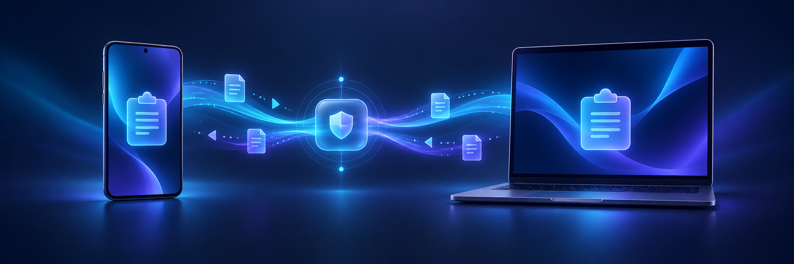

<div align="center">
  
  <br><br>
  
  <h1>KDE Connect with Shizuku clipboard sync</h1>
  <p><strong>Copy on Android. Paste on your computer.</strong><br>Reliable background clipboard sharing for modern Android.</p>

  [](https://github.com/huzzyz/kdeconnect-android/actions/workflows/rebase-and-release.yml)
  [](https://github.com/huzzyz/kdeconnect-android/releases/latest)
  [](https://invent.kde.org/network/kdeconnect-android)
</div>

---

> Android stopped letting background apps read the clipboard. This fork restores the KDE Connect workflow through Shizuku, without polling, another foreground service, or a wake lock.

<p align="center">
  <a href="https://github.com/huzzyz/kdeconnect-android/releases/latest"><strong>Download the latest APK</strong></a>
  ·
  <a href="#quick-start"><strong>Set it up</strong></a>
  ·
  <a href="#troubleshooting"><strong>Troubleshoot</strong></a>
</p>

This fork uses an authorized [Shizuku](https://shizuku.rikka.app/) service to detect Android clipboard changes, then sends the text through KDE Connect's existing encrypted device connection.

The `shizuku-clipboard` branch stays close to the upstream [KDE Connect Android app](https://invent.kde.org/network/kdeconnect-android) and rebases onto new upstream releases.

## What you get

| | Capability | Behaviour |
| :---: | --- | --- |
| 📋 | **Two-way text clipboard** | Copy text between Android and every paired desktop |
| 🔄 | **Automatic recovery** | Reconnect after Shizuku stops, restarts, or replaces its Binder |
| 🔋 | **Battery-conscious design** | React to system events instead of running a polling loop |
| 🧹 | **Scoped cleanup** | Remove only orphaned clipboard monitors created by this fork |
| 📱 | **Side-by-side install** | Keep the official KDE Connect app installed independently |
| 🧩 | **Full KDE Connect** | Retain notifications, file sharing, media control, remote input, and device status |

> [!NOTE]
> Clipboard synchronization transfers text. For images and files, use KDE Connect's **Share** action or drag files onto a scrcpy/PhoneScreen window.

## Quick start

<table>
  <tr>
    <td align="center"><strong>1</strong><br>Start Shizuku</td>
    <td align="center">→</td>
    <td align="center"><strong>2</strong><br>Install the APK</td>
    <td align="center">→</td>
    <td align="center"><strong>3</strong><br>Grant access</td>
    <td align="center">→</td>
    <td align="center"><strong>4</strong><br>Pair and copy</td>
  </tr>
</table>

### 1. Start Shizuku

Install [Shizuku](https://shizuku.rikka.app/), start its service through wireless debugging or root, and leave the service running.

Wireless-debugging startup must usually be repeated after the phone reboots. Some compatible Shizuku managers provide their own restart mechanism.

### 2. Install the APK

Download the newest APK from [Releases](https://github.com/huzzyz/kdeconnect-android/releases/latest), then open it on the phone and approve installation from that source.

The fork installs beside official KDE Connect. Future APKs signed with the same release key update this fork in place and preserve its pairing data.

### 3. Grant access

Open Shizuku's **Authorized applications**, select **KDE Connect (Shizuku)**, and grant permission.

### 4. Pair and enable clipboard sync

Open KDE Connect on the phone and computer, pair the devices, then enable the **Clipboard** plugin for that device.

Copy text on either device to test both directions:

```text
Android clipboard  ───────▶  Shizuku monitor  ───────▶  KDE Connect  ───────▶  Desktop
Desktop clipboard  ────────────────────────────────▶  KDE Connect  ───────▶  Android
```

## 🔋 Recovery without a battery tax

The fork listens for Shizuku Binder lifecycle events. When Shizuku disconnects, KDE Connect closes its stale clipboard monitor. When Shizuku returns, the app checks authorization, removes monitors previously marked as its own, and starts one replacement.

Recovery does not add a polling loop, wake lock, or foreground service. A failed monitor start retries after 1, 2, 4, 8, 16, and 30 seconds. It then waits for the next Shizuku connection event. A received clipboard event resets that retry budget.

## ✅ Requirements

- Android 6 or newer
- Shizuku or a compatible Shizuku manager
- KDE Connect on the computer
- Both devices reachable over the same network or another working KDE Connect route
- Clipboard plugin enabled for the paired device

<a id="troubleshooting"></a>

## 🛠 Troubleshooting

### Android → desktop stops working

1. Confirm Shizuku says **Running**.
2. Confirm **KDE Connect (Shizuku)** remains authorized in Shizuku.
3. Open KDE Connect and check that the computer is reachable.
4. Check that the paired device's **Clipboard** plugin is enabled.
5. Restart Shizuku. The fork should reconnect without revoking and granting permission again.

### Desktop → Android stops working

Check the desktop KDE Connect clipboard plugin and device connection first. This direction uses the standard KDE Connect implementation and does not depend on Shizuku clipboard monitoring.

### The devices cannot find each other

Confirm both devices use the same network, disable client isolation or guest-network isolation, and allow KDE Connect through the computer firewall. VPN and multi-VLAN setups may need explicit routing and firewall rules.

### Installation reports a signature conflict

Android only accepts an in-place update when the signing certificate matches. Uninstall an incompatible build before installing this fork. Uninstalling removes that build's local pairing and settings.

## 🔐 Security model

Shizuku grants elevated API access to applications you authorize. Grant access only to APKs you trust. This fork uses that permission to start the clipboard log monitor; KDE Connect continues to handle device pairing, encryption, and clipboard transport.

The release workflow builds a signed APK, verifies its package ID and signing certificate, runs unit tests, and retains the verified artifact. Automated releases track the latest upstream version tag.

## 🧑‍💻 Build from source

Open the project in Android Studio, or run:

```shell
./gradlew testDebugUnitTest assembleDebug
```

Release builds require the signing configuration used by the GitHub Actions workflow.

## 💙 Upstream and licensing

Report Shizuku clipboard problems in this repository. Report general KDE Connect issues through the [KDE bug tracker](https://bugs.kde.org/) or the [upstream project](https://invent.kde.org/network/kdeconnect-android).

KDE Connect is licensed under the GNU General Public License. See [COPYING](COPYING) and [LICENSES](LICENSES) for details.
